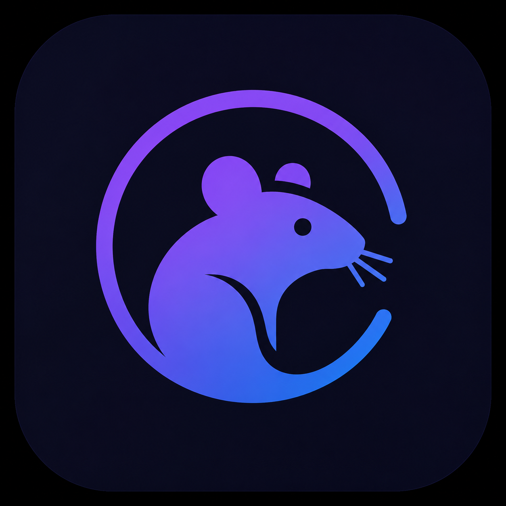

# LocalDNS Server



LocalDNS Server is the coordination layer for the Ratter stack. It exposes an HTTP API, a dashboard, and the orchestration logic needed to keep local DNS records, certificates, and reverse-proxy routes in sync for development environments.

It is designed to run alongside two heavy external services:

- Caddy, which handles reverse proxying and HTTPS automation through the Caddy Admin API.
- Technitium DNS Server, which provides the DNS resolution layer for local domains.

The server also uses `mkcert` for generating local certificates and stores its own state in SQLite(depreciated).

## What It Does

LocalDNS Server provides a single process that can:

- create, update, enable, disable, and delete local domains
- push DNS records into Technitium
- create and maintain Caddy reverse-proxy routes
- generate and delete local TLS certificates with `mkcert`(depreciated)
- expose an OpenAPI document and Swagger UI for the API
- surface Technitium query logs and server logs through the API
- serve the landing page and dashboard UI from the same runtime

## Architecture

The server runs as a small Hono application on port `4321` and coordinates the rest of the stack through admin APIs.

```text
Browser
  -> LocalDNS Server (:4321)
  -> Technitium DNS Server (:5380)
  -> Caddy Admin API (:2019)
  -> Local apps on the chosen upstream ports
```

Startup flow:

1. load environment variables from `.env`
2. initialize the SQLite database in `~/.localdns/localdns.db`
3. bootstrap Technitium DNS records and Caddy routes from the stored domain list
4. start polling Technitium logs
5. serve the API, landing page, dashboard, and docs

## Repository Layout

```text
localdns-server/
├── src/
│   ├── routes/          # API routes for domains, dns, certs, logs, and settings
│   ├── services/        # Technitium, Caddy, cert, and log orchestration
│   ├── startup/         # Dependency checks and bootstrap logic
│   ├── db/              # SQLite client and schema
│   └── openapi/         # OpenAPI schemas
├── landing/             # Public landing page and dashboard assets
├── scripts/             # Helper scripts for setup and cleanup
├── caddy.json           # Caddy configuration used by the server
├── Caddyfile            # Local Caddy entry configuration
└── openAPI.json         # Generated API contract
```

## Requirements

- Node.js 22 or newer
- npm
- Caddy
- Technitium DNS Server
- `mkcert`
- Access to the Technitium and Caddy admin endpoints

## Installation

Install dependencies from the `localdns-server` folder:

```bash
npm install
```

If you use a fresh machine, make sure `mkcert`, Caddy, and Technitium are installed and available before starting the server.

## Development

Start the server in watch mode:

```bash
npm run dev
```

Run the production-style entrypoint:

```bash
npm start
```

Run the test suite:

```bash
npm test
```

The server listens on `http://localhost:4321` by default.

## Main Endpoints

### UI

- `/` - landing page
- `/dashboard` - dashboard SPA
- `/docs` - Swagger UI
- `/openapi.json` - OpenAPI document

### API

- `/api/domains` - domain management
- `/api/dns` - DNS helpers and zone operations
- `/api/certs` - certificate management
- `/api/log` - log inspection and Technitium log access
- `/api/settings` - persistent application settings

## Configuration

Most runtime configuration is controlled through environment variables and the stored settings table.

### Environment Variables

| Variable | Default | Purpose |
| --- | --- | --- |
| `TECHNITIUM_URL` | `http://localhost:5380` | Base URL for the Technitium API |
| `TECHNITIUM_API_KEY` | unset | Bearer token used for Technitium API authentication |
| `TECHNITIUM_NODE` | unset | Optional Technitium cluster node identifier |
| `TECHNITIUM_LOGS_APP_NAME` | unset | Required for query-log access |
| `TECHNITIUM_LOGS_CLASS_PATH` | unset | Required for query-log access |
| `CADDY_ADMIN_URL` | `http://localhost:2019` | Base URL for the Caddy Admin API |
| `CADDY_UPSTREAM_HOST` | `localhost` | Hostname used when building upstream targets |

### Stored Settings

Settings are stored in SQLite at `~/.localdns/localdns.db`. Important keys include:

- `dns_port`
- `upstream_dns`
- `cert_dir`
- `technitium_url`
- `caddy_admin_url`
- `app_domain`
- `app_port`

The default certificate directory is `~/.localdns/certs` unless overridden.

## How It Works

When a domain is created or updated, LocalDNS Server keeps all of the related infrastructure in sync:

1. a DNS record is created or updated in Technitium
2. a route is created or updated in Caddy
3. a certificate can be generated for the domain if needed
4. the UI and API expose the current state for inspection

This lets you work with names like `api.local`, `dashboard.local`, or `app.test` instead of juggling ports and hosts-file edits.

## Technitium Integration

Technitium is responsible for the DNS layer. LocalDNS Server uses it to:

- create DNS zones and records
- enable or disable records
- remove records when a domain is deleted
- query logs for traffic and diagnostics
- list and download Technitium log files

If Technitium is unavailable, domain bootstrap and log access will fail until it is reachable again.

## Caddy Integration

Caddy is responsible for the reverse proxy and HTTPS layer. LocalDNS Server uses the Caddy Admin API to:

- create the localdns server block
- add and remove routes incrementally
- preserve existing TLS and admin configuration
- route host-based traffic to local upstream ports

This is intentionally not done through a full config reload, because preserving Caddy state is important for stable local development.

## Certificates(depreciated, Caddy handles it!)

Certificate generation is handled with `mkcert` and stored in the configured certificate directory.

Common operations:

- generate a certificate for a domain
- delete certificate files when a domain is removed
- keep local development traffic on HTTPS with trusted certificates

## Troubleshooting

If startup fails, check the following first:

- Caddy is running and its admin endpoint is reachable
- Technitium is running and its API endpoint is reachable
- your `.env` values match the local services you actually run
- the required Technitium log settings are set if you expect log access

If domains are not resolving, confirm that Technitium is serving the zone and that your system DNS points at the local resolver you configured.

If routes are missing, inspect the Caddy Admin API and make sure the `CADDY_ADMIN_URL` and `CADDY_UPSTREAM_HOST` values are correct.

## Tests

The repository uses Vitest. The existing test suite covers the log poller and the Technitium integration pieces.

```bash
npm test
```

## Notes for Future Packaging

This project is primarily a local engine, not a published npm library. If you want to distribute it through npm, you should first decide whether it is meant to be installed as an executable app, a private internal package, or split into reusable packages.
